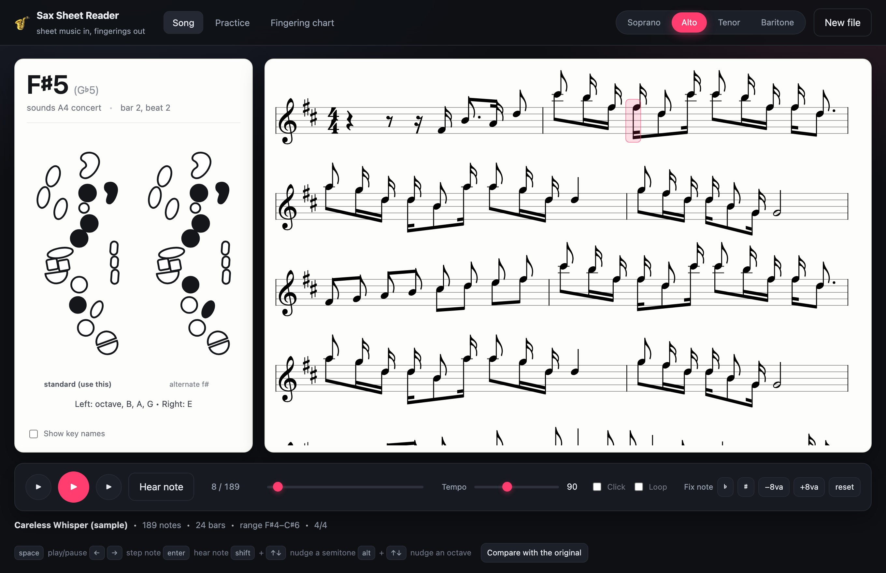
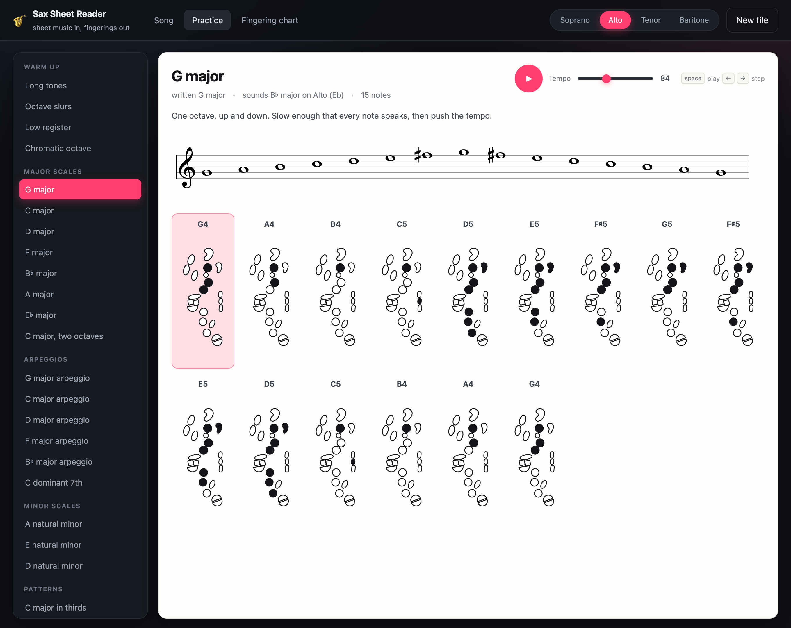
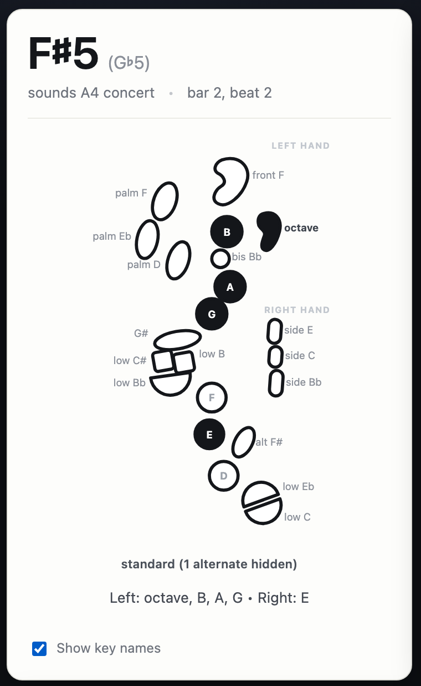
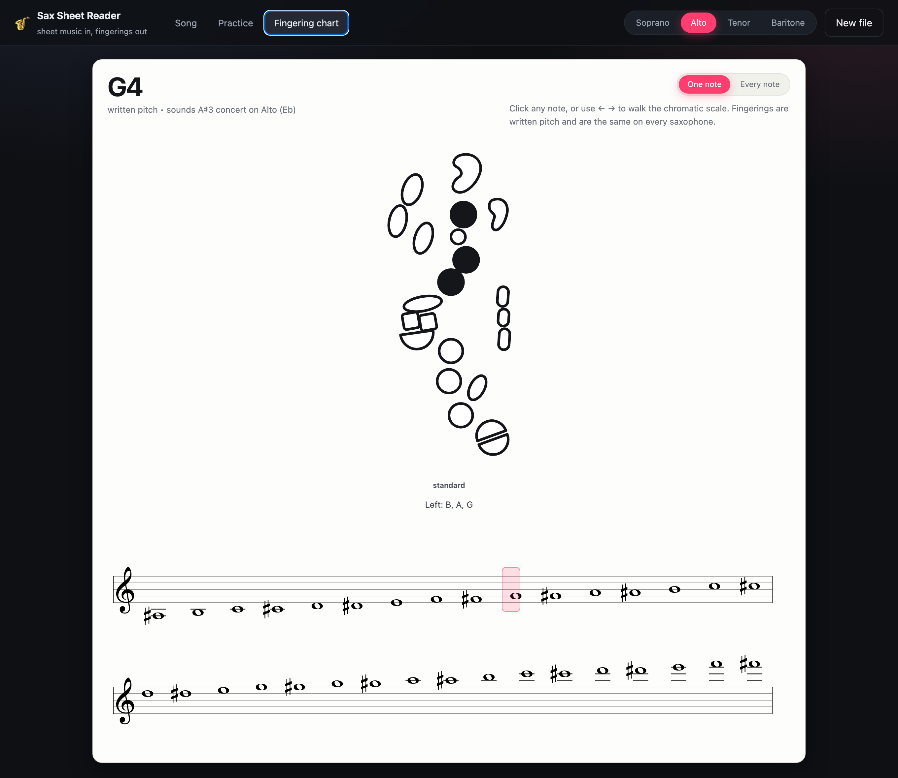
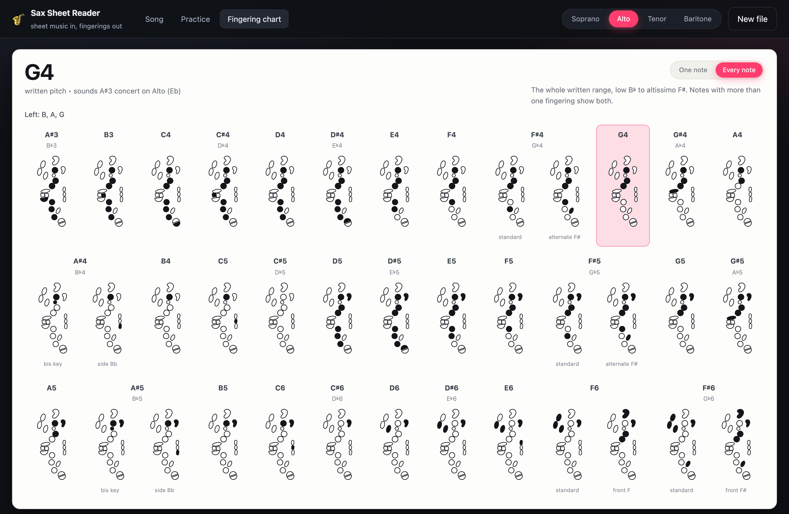

# SaxHelper

Drop in a PDF, photo or scan of sheet music and get the alto sax fingering for
every note, in order. Runs entirely on your own machine.



## What it does

- **Reads the page.** Optical music recognition turns a PDF or image into notes;
  multi-page PDFs are stitched into one piece.
- **Shows the fingering** in the printed-chart style — filled keys are the ones
  you press — plus alternates where they exist (bis Bb, side keys, alt F#).
- **Walks the piece** note by note, or plays it back with a synth tone, a
  tempo slider, a metronome click and looping.
- **Transposes** for soprano, alto, tenor and baritone, and tells you the
  concert pitch each written note sounds.
- **Lets you fix mistakes.** Recognition is never perfect, so click any note and
  nudge it by a semitone or an octave, or open the original page side by side.
- **Practice page** of warm-ups, scales, arpeggios and patterns, each laid out
  with every fingering on screen at once.
- **Fingering chart** for looking up one note, or the whole written range on a
  single screen, no file needed.

## Run it

```bash
git clone git@github.com:Aishlia/SaxHelper.git
cd SaxHelper
./run.sh
```

Needs Python 3.11 or newer. The first run creates `.venv` and installs the
requirements (using [uv](https://github.com/astral-sh/uv) if you have it), then
opens <http://localhost:8765>. The recognition models download once, about
200 MB, and are cached afterwards.

No file to hand? Hit **Try the sample**.

## Keyboard

| Key | Action |
| --- | --- |
| `space` | play / pause |
| `←` `→` | step a note |
| `enter` | hear the current note |
| `shift` + `↑` `↓` | nudge the note a semitone |
| `alt` + `↑` `↓` | nudge the note an octave |

On the practice page, `space` plays the drill and `←` `→` step through it. On the
fingering chart, `←` `→` walk the chromatic scale.

## Practice

Two dozen drills, from long tones and octave slurs up through the seven scale
keys band music actually asks for, arpeggios, natural minors and patterns. Pick
one and the whole thing is on screen: the notation, then a fingering for every
note in order. Play it back at any tempo and the highlight follows along, or
click a single diagram to hear that note.



Drills are written pitch, and the header tells you what key that lands in for
the horn you picked — written G major sounds B♭ major on an alto.

## Reading a diagram

Every key sits roughly where it does on the horn, so you can read the diagram
straight onto the instrument. Tick **Show key names** if you are still learning
which key is which.



## Fingering chart

Look a note up without a file. Click it on the chromatic staves or walk the range
with the arrow keys, and you get the same full-size diagram the song view shows,
alternates included.



Switch to **Every note** for the whole written range on one screen, low B♭ up to
altissimo F♯. Notes with a choice show both fingerings side by side — bis B♭ next
to side B♭, standard F♯ next to the alternate.



## How it works

```
PDF / image ──► page images ──► recogniser ──► MusicXML ──► note list ──► fingerings
   PyMuPDF                        homr                      score.py     fingerings.py
```

The backend is FastAPI. Uploads become background jobs so the page can report
progress while a scan is being read; MusicXML files skip recognition entirely.
The fingering table and the diagram geometry live together in one module, so
the picture and the keys it names can never drift apart.

| Path | What's in it |
| --- | --- |
| `backend/app.py` | HTTP API, upload handling, job queue |
| `backend/omr.py` | page rasterising and the recogniser |
| `backend/score.py` | MusicXML → flat note list, multi-page merge |
| `backend/fingerings.py` | key layout and the chromatic fingering table |
| `backend/warmups.py` | the practice drills, as lists of written pitches |
| `frontend/` | the app: score rendering, diagrams, playback |
| `tools/` | headless-browser scripts for screenshots and checks |

## Worth knowing

- Recognition quality follows scan quality. Flat, straight, well-lit pages with
  clean staff lines work best; handwriting and heavy chord symbols confuse it.
- Fingerings are written pitch, so they are identical on every saxophone. The
  transposing toggle only changes the concert pitch that is reported.
- Above written F#6 the app falls back to the nearest note an octave down and
  says so: altissimo has no standard fingering, it varies by player and horn.
